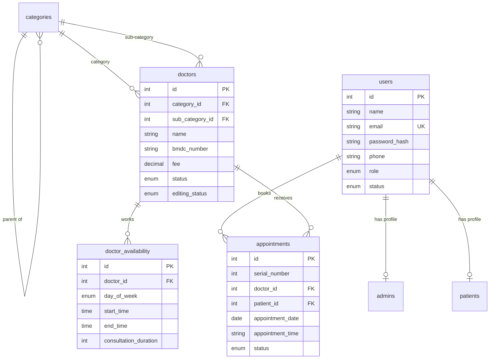

# 🏥 Meridian Hospital Chattogram — Appointment Booking System


> **Serving with Care & Compassion**
> A hospital appointment website built with **PHP & MySQL** — patients find a doctor, pick a real time slot and book online, while staff manage everything from a full admin panel.

📍 1367 CDA Avenue, GEC Circle, Chattogram, Bangladesh · 🕐 Open 24/7

---

## 📌 Table of contents

1. [Project summary](#1-project-summary)
2. [Problem & goals](#2-problem--goals)
3. [Users & roles](#3-users--roles)
4. [Features](#4-features)
5. [How the main flows work](#5-how-the-main-flows-work)
6. [Architecture](#6-architecture)
7. [Database design](#7-database-design)
8. [Page & file reference](#8-page--file-reference)
9. [Security](#9-security)
10. [UI / UX & design system](#10-ui--ux--design-system)
11. [Seed data](#11-seed-data)
12. [Installation (XAMPP)](#12-installation-xampp--localhost)
13. [Deploy to shared hosting](#13-deploy-to-shared-hosting)
14. [Change the admin password](#14-change-the-admin-password)
15. [Troubleshooting](#15-troubleshooting)
16. [Testing](#16-testing)
17. [Known limitations](#17-known-limitations)
18. [Roadmap](#18-roadmap)
19. [Hospital information](#19-hospital-information)
20. [License](#20-license)

---

## 1. Project summary

| | |
|---|---|
| **Name** | Meridian Hospital Chattogram — Appointment Booking System |
| **Type** | Server-rendered multi-page web application |
| **Backend** | PHP 8+ (procedural, PDO) |
| **Database** | MySQL / MariaDB (InnoDB, utf8mb4) |
| **Frontend** | HTML5, CSS3, vanilla JavaScript (no framework) |
| **Libraries** | Chart.js (admin chart), Google Fonts (Poppins) |
| **Theme** | Light green / teal, glassmorphism accents, subtle motion |
| **Seed data** | 94 doctors · 25 sub-specialties · 473 weekly availability slots |
| **License** | MIT |

---

## 2. Problem & goals

**Problem.** Booking a doctor by phone is slow, limited to office hours, and hard for the hospital to track.

**Goals**

- Let patients book any time, from any device, without calling.
- Prevent **double-booking** of the same slot.
- Give staff one dashboard for doctors, categories, patients and appointments.
- Stay simple enough to run on **free shared hosting** and a local **XAMPP** install.
- Keep patient and admin logins in **one shared user system**, separated by role.

---

## 3. Users & roles

Patients and staff live in one `users` table; the `role` column decides access.

| Role | Login page | Can do |
|---|---|---|
| **Visitor** | — | Browse doctors, view profiles and slots, read About / Contact |
| **Patient** | `/login.php` | Register, book appointments, view and cancel own appointments |
| **Staff** | `/admin/login.php` | Use the admin panel |
| **Admin / Super admin** | `/admin/login.php` | Everything staff can do, plus manage users |

> Admin and patient logins are **separate entry points** that share the **same table and password system**. A patient account cannot open the admin panel, and an admin account is rejected by the patient login.

---

## 4. Features

### 4.1 Patient website

- **Home** — hero section, specialty quick-links with icons, top doctors, call-to-action banner
- **All Doctors** — grid of approved doctors with a sidebar filter by specialty and sub-specialty
- **Doctor profile** — photo, degrees, experience, workplace, about, fee and a **7-day date picker**; choosing a day loads that doctor's **live time slots** via AJAX; booked slots are struck through and disabled; related doctors are suggested
- **Booking flow** — stepper (Select doctor → Select slot → Confirm details → Success) with an animated success screen
- **Guest booking** — a visitor who clicks *Book* is sent to log in or register, then returned to finish the same booking
- **Registration & login** — name, email, phone, age, gender, address, password (min 6 characters)
- **My Appointments** — all own bookings with status badges and a **Cancel** button for upcoming pending/confirmed ones
- **About** and **Contact** pages
- Fully **responsive** (mobile menu, flexible grids)

### 4.2 Admin panel (`/admin`)

- **Dashboard** — animated counters (total / approved / pending / on-hold / banned doctors; all / completed / confirmed / pending appointments; total patients) and a **7-day appointments chart**
- **Doctor list** — search (name, BMDC, email), pagination, inline **status dropdown** (Approved / Pending / Hold / Banned), **edit-lock** toggle, edit and delete
- **Add / Edit doctor** — category and sub-category, name, designation, degrees, BMDC number, phone, email, workplace, specialist-in, experience, fee, priority, about, status, **photo and signature upload**, and a **weekly availability editor**
- **Categories** — add, rename, delete main categories and sub-categories, with doctor counts
- **Patients** — searchable list with contact details and appointment counts
- **Users** — add admin/staff accounts, enable/disable them (you cannot disable yourself)
- **Appointments** — analytics cards, filters by date / status / text, per-row **status control**
- **Table export** — Copy, CSV, Excel-compatible CSV and Print (client-side)

---

## 5. How the main flows work

### 5.1 Booking an appointment

```
Visitor opens a doctor profile
  └─ picks a date → JS calls get-slots.php?doctor_id=..&date=..
       └─ server finds availability for that weekday,
          builds slots (start → end, step = consultation length),
          marks slots already booked (status ≠ cancelled)
  └─ picks a slot → "Book an Appointment"
       ├─ not logged in → saved in session → login/register → resume
       └─ logged in → confirmation page (describe the problem)
            └─ INSERT appointment (status = pending, serial number assigned)
                 ├─ unique key violated → "slot was just booked" message
                 └─ success → animated success screen
```

### 5.2 Serial numbers
Each new appointment gets `MAX(serial_number) + 1` **per doctor per date**, so serial numbers restart every day for every doctor.

### 5.3 Slot generation
The weekday (`Sat…Fri`) is matched against `doctor_availability`. Slots run from `start_time` to `end_time` in steps of `consultation_duration` minutes (**minimum 5**, which also prevents zero-length loops). Cancelled appointments free their slot again.

### 5.4 Appointment lifecycle

```
pending ──► confirmed ──► completed
   │            │
   └────────────┴──► cancelled   (by patient or admin)
```

### 5.5 Doctor edit-lock
While `editing_status = locked`, the edit page shows a warning and hides the form until an admin unlocks the profile in the doctor list.

---

## 6. Architecture

### 6.1 Folder structure

```
├── admin/                    Admin panel pages
│   └── includes/             Shared layout: head, sidebar, topbar, foot
├── assets/
│   ├── css/                  style.css (patient) · admin.css (admin)
│   ├── js/                   main.js (patient) · admin.js (admin)
│   └── images/               logo, doctor photos, specialty icons
├── config/
│   ├── config.php            Site constants, session, auto BASE_URL
│   ├── db.example.php        Database template (copy to db.php)
│   └── db.php                Real credentials (git-ignored)
├── database/
│   ├── schema.sql            Tables + default admin + main categories
│   ├── seed_doctors.sql      Sub-categories, doctors, availability
│   ├── import_doctors.php    CLI CSV importer
│   └── data/                 Source CSV exports
├── includes/                 header.php · footer.php · functions.php
├── uploads/doctors/          Runtime uploads (git-ignored)
└── *.php                     Patient pages (root level)
```

### 6.2 Request lifecycle
Every page starts with `require_once includes/functions.php`, which loads `config.php` (session, constants, auto `BASE_URL`) and `db.php` (a PDO connection in `$pdo`). Pages run their queries, then include the shared header/footer (patient) or the admin layout partials.

### 6.3 Auto-detected `BASE_URL`
`config.php` compares its own folder on disk with the web server's document root to work out the site's URL path. The site therefore runs at a domain root **or** in any sub-folder without editing constants.

### 6.4 Local vs live configuration
`db.example.php` selects **local** settings on `localhost` / `127.0.0.1` and **live** settings elsewhere, so one file works in both places. PHP errors are displayed only on localhost.

---

## 7. Database design

### 7.1 Entity-relationship diagram



### 7.2 Tables

| Table | Purpose | Notable columns |
|---|---|---|
| `users` | Shared login for patients, staff, admins | `email` (unique), `password_hash` (bcrypt), `role`, `status` |
| `admins` | Permission level for staff/admin users | `permission_level` |
| `patients` | Patient profile details | `age`, `gender`, `address`, `medical_notes` |
| `categories` | Two-level specialty tree (self-referencing) | `parent_id`, `icon` |
| `doctors` | Doctor profile | `category_id`, `sub_category_id`, `bmdc_number`, `fee`, `priority`, `status`, `editing_status` |
| `doctor_availability` | Weekly schedule, one row per doctor per weekday | `day_of_week`, `start_time`, `end_time`, `consultation_duration` |
| `appointments` | Bookings with a patient snapshot | `serial_number`, `appointment_date`, `appointment_time`, `status`, `patient_*` |

### 7.3 Key constraints

- `appointments` has **`UNIQUE (doctor_id, appointment_date, appointment_time)`** — double-booking is blocked by the database itself, not only by application code.
- Foreign keys use `ON DELETE CASCADE` for dependent rows (deleting a doctor removes their availability and appointments) and `ON DELETE SET NULL` for categories.
- Appointments store a **snapshot** of patient name, age, gender and address, so history stays accurate if a profile changes later.

### 7.4 Category model
Seven top-level categories: **General Physician, Gynecologist, Dermatologist, Pediatricians, Neurologist, Gastroenterologist** (each with an icon on the home page) and **Specialist**. The 25 detailed sub-specialties (Cardiology, ENT, Orthopedics, Urology, …) sit under *Specialist*.

---

## 8. Page & file reference

### Patient pages

| File | Purpose |
|---|---|
| `index.php` | Home |
| `doctors.php` | Doctor directory with filters |
| `doctor.php` | Doctor profile + slot picker |
| `get-slots.php` | JSON endpoint: available slots for a doctor and date |
| `book-appointment.php` | Confirm booking, insert, success screen |
| `register.php` / `login.php` / `logout.php` | Patient authentication |
| `my-appointments.php` | Patient's bookings |
| `cancel-appointment.php` | Cancel own appointment (POST + CSRF) |
| `about.php` / `contact.php` | Static and contact pages |

### Admin pages

| File | Purpose |
|---|---|
| `admin/login.php` / `logout.php` | Admin authentication |
| `admin/index.php` | Dashboard |
| `admin/doctors.php` | Doctor list, status and lock |
| `admin/add-doctor.php` / `edit-doctor.php` / `delete-doctor.php` | Doctor CRUD |
| `admin/categories.php` | Category management |
| `admin/patients.php` | Patient list |
| `admin/users.php` | Staff and admin accounts |
| `admin/appointments.php` | Appointment analytics and management |

### Core helpers (`includes/functions.php`)
CSRF (`csrf_token`, `csrf_field`, `verify_csrf`) · sanitising (`clean`) · auth (`is_patient`, `is_admin`, `require_*_login`, `login_user`, `logout_user`) · formatting (`format_money`, `status_badge`, `doctor_image_url`) · booking (`next_days`, `build_time_slots`) · utilities (`redirect`, `flash`).

---

## 9. Security

| Area | Implementation |
|---|---|
| **Passwords** | bcrypt via `password_hash` / `password_verify` |
| **SQL injection** | PDO **prepared statements** everywhere |
| **XSS** | Output escaped with `htmlspecialchars` through the `clean()` helper |
| **CSRF** | Per-session token on state-changing forms, verified with `hash_equals` |
| **Access control** | Role checks (`require_patient_login`, `require_admin_login`) on protected pages |
| **Cancel authorisation** | Patients can cancel only appointments whose `patient_id` matches their own |
| **Double-booking** | Database unique key + friendly error on collision |
| **Uploads** | Extension whitelist (jpg, jpeg, png, webp), 3 MB limit, random file names |
| **File exposure** | `.htaccess` denies web access to `config/` and `database/`; `.sql` / `.md` blocked at root |
| **Secrets** | `config/db.php` is git-ignored; only `db.example.php` is committed |
| **Error output** | PHP errors shown only on localhost |
| **Sessions** | New session id issued on logout |

---

## 10. UI / UX & design system

- **Colour tokens** — primary `#1f9d6b`, dark `#157a52`, light `#e6f7ef`, accent `#34d399`, background `#f4faf7`. Status colours: green (approved/confirmed), yellow (pending), orange (hold), red (banned/cancelled), blue (completed).
- **Typography** — Poppins (Google Fonts) with system fallbacks.
- **Components** — sticky blurred navbar, glass cards, doctor cards with hover lift, pill buttons with a magnetic hover effect (desktop pointers only), date tabs, slot chips with selected/disabled states, stepper, skeleton shimmer while images load, animated success checkmark.
- **Motion** — scroll-reveal via `IntersectionObserver`, floating icons, count-up numbers and chart animation in admin. All motion is disabled for users who prefer reduced motion.
- **Responsive** — flexbox/grid layouts, collapsible mobile menu (patient) and off-canvas sidebar (admin).

---

## 11. Seed data

Loaded from the hospital's dashboard CSV exports:

- **94 doctors** with degrees, BMDC numbers, contact info, fees, priority and about text
- **25 sub-specialties** under *Specialist*
- **473 availability rows** parsed from each doctor's available days, start/end time and consultation length
- All imported doctors are set to **Approved** and **Unlocked**
- Doctor photos are **placeholder images** (15 stock portraits reused in rotation) — replace them through *Edit Doctor*

`seed_doctors.sql` uses **explicit IDs** instead of `LAST_INSERT_ID()`, so it survives phpMyAdmin's chunked imports, and it clears earlier partial data first, so it is safe to re-run.

---

## 12. Installation (XAMPP / localhost)

**Requirements:** PHP 8.0+ with `pdo_mysql`, MySQL 5.7+ / MariaDB 10.3+, Apache.

1. **Clone** into your web root:
```bash
   cd C:/xampp/htdocs
   git clone https://github.com/mdsajidbin/meridian-hospital-appointment-system.git Meridian_Hospital_Chattogram
```
2. Start **Apache** and **MySQL** in the XAMPP control panel.
3. In phpMyAdmin, create an empty database named `meridian_hospital` (collation `utf8mb4_general_ci`).
4. Select that database → **Import**, in this order:
   1. `database/schema.sql`
   2. `database/seed_doctors.sql`
5. Configure the connection:
```bash
   cp config/db.example.php config/db.php
```
   For XAMPP defaults use host `127.0.0.1`, user `root`, empty password. If your MySQL runs on a different port (for example `3307`), set `DB_PORT` to match.
6. Open **http://localhost/Meridian_Hospital_Chattogram/**

**Admin panel:** `http://localhost/Meridian_Hospital_Chattogram/admin/login.php`

| Field | Value |
|---|---|
| Email | `Mohammadsajid1114@gmail.com` |
| Password | `ChangeMe@2026` |

> ⚠️ **Change this password immediately** — see [section 14](#14-change-the-admin-password).

### Adding doctors

- **One by one:** Admin → *Doctor → Add Doctor* (category, sub-category, BMDC, degrees, fee, availability, image, signature, …)
- **In bulk:** replace `database/data/doctors.csv` (same column order) and run
```bash
  php database/import_doctors.php
```

---

## 13. Deploy to shared hosting

Works on InfinityFree, ProFreeHosting, cPanel and similar hosts.

1. Create a MySQL database in your host's control panel. You usually **cannot** run `CREATE DATABASE`, and the SQL files here do not need it.
2. Open phpMyAdmin, select **your** database, and import `schema.sql`, then `seed_doctors.sql`.
3. Upload all files into `htdocs/` (or `public_html/`).
4. Copy `config/db.example.php` to `config/db.php` and fill in the **live** block (host, database name, user, password from your hosting panel).
5. Make `uploads/doctors/` writable (chmod 755 or 775).

---

## 14. Change the admin password

MySQL cannot create bcrypt hashes, so generate one with PHP:

```bash
php -r "echo password_hash('YourNewStrongPassword', PASSWORD_BCRYPT), PHP_EOL;"
```

Then run this in phpMyAdmin → SQL:

```sql
UPDATE `users`
SET `password_hash` = 'PASTE_THE_HASH_HERE'
WHERE `email` = 'Mohammadsajid1114@gmail.com';
```

---

## 15. Troubleshooting

| Problem | Fix |
|---|---|
| `Missing config/db.php` | Copy `config/db.example.php` to `config/db.php` |
| `Access denied for user 'root'` | Wrong password or wrong `DB_PORT` (XAMPP may use 3307) |
| Page shows unstyled links / no logo | Hard refresh (`Ctrl+Shift+R`) and make sure the whole folder was uploaded |
| `#1044 Access denied` on import | Import into the database you already created; do not run `CREATE DATABASE` |
| `#1452 foreign key` on seed import | Import `schema.sql` first, into an empty database |
| Doctor photos not uploading | Make `uploads/doctors/` writable |

---

## 16. Testing

Verified during development with PHP's built-in server (SQLite stand-in for the data layer) and then on XAMPP:

- Every page renders with no PHP warnings
- Registration, login, guest-booking redirect and resume
- Full booking → confirmation → shows in *My Appointments*
- Double-booking of the same slot rejected
- Patient cancel; admin status changes
- Doctor add / edit / delete, status dropdown, edit-lock enforcement
- Category add, staff user add and enable/disable
- Auto `BASE_URL` in a sub-folder deployment
- Seed import: 94 doctors, 473 availability rows, no orphaned rows, safe to re-run

> There is **no automated test suite** yet — see the roadmap.

---

## 17. Known limitations

- **Contact form does not send email** — it only shows a confirmation message
- **No email / SMS notifications** for bookings or status changes
- **No online payment** — the fee is displayed only
- **No doctor login** — doctors have no dashboard yet (a `password_hash` column is reserved)
- **Doctor delete** in the admin list uses a plain link and is not CSRF-protected — it should become a POST action
- **Placeholder content** — the home page's "Trusted by 20,000+ patients" and "94 doctors online today" are static text; the message/notification icons in the admin top bar are decorative
- **Past slots** are still shown for the current day
- **Availability** uses one start/end time per doctor across all selected days
- **No pagination** on patients and users; appointments are capped at 200 rows
- **Seed data contains real doctor contact details** — keep the repository private or replace them with dummy data before making it public

---

## 18. Roadmap

- [ ] Email and SMS confirmations
- [ ] Doctor portal (own schedule, patient list, prescriptions)
- [ ] Online payment (bKash / Nagad / card)
- [ ] Hide past slots; per-day custom availability and leave days
- [ ] Convert destructive admin actions to POST + CSRF
- [ ] Patient profile page, password reset, email verification
- [ ] PDF appointment slip with serial number and QR code
- [ ] Multi-language (English / বাংলা)
- [ ] Automated tests (PHPUnit) and CI with GitHub Actions
- [ ] REST API for a future mobile app

---

## 19. Hospital information

| | |
|---|---|
| **Hospital** | Meridian Hospital Chattogram |
| **Address** | 1367 CDA Avenue, GEC Circle, Chattogram, Bangladesh |
| **Main contact** | 01622295857 / 01307284064 |
| **Appointments** | 01622295857 |
| **Emergency (24/7)** | 01879470036 |
| **Email** | Mohammadsajid1114@gmail.com |
| **Hours** | Open 24/7 |

---

## 20. License

Released under the [MIT License](LICENSE).

**Credits** — Built from a Product Requirements Document for the hospital; layout inspiration and placeholder doctor images from the *Prescripto* asset pack; logo © Meridian Hospital Chattogram.
